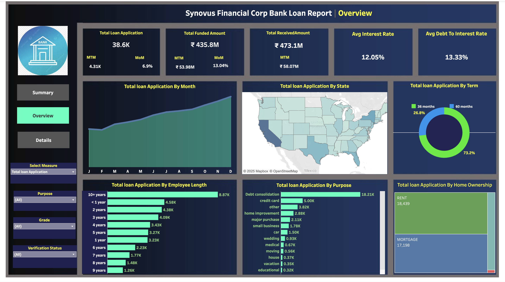
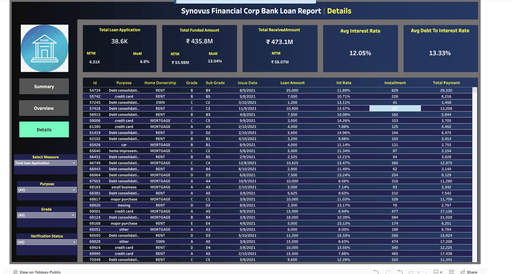
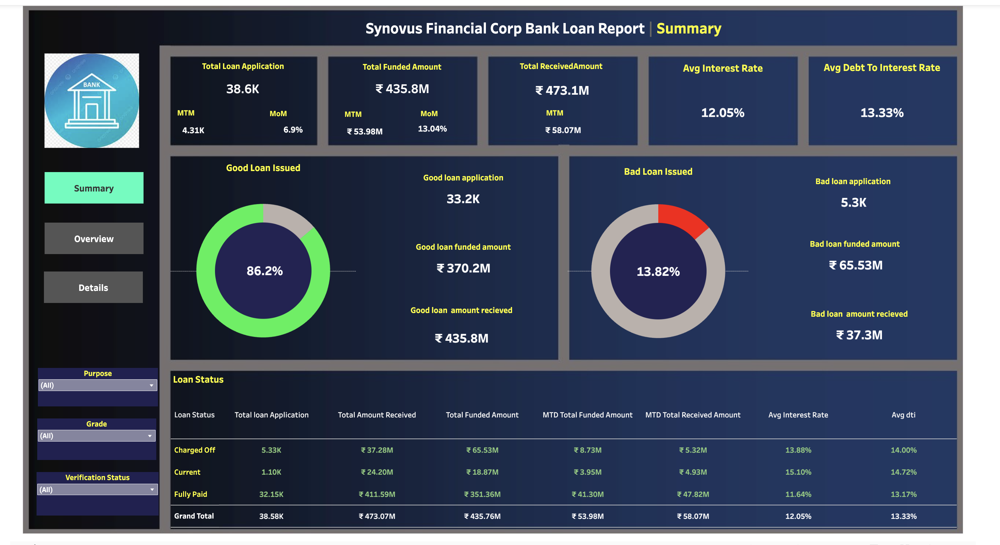

# 📊 Synovus Financial Corp Bank Loan Report – Data Analysis Dashboard

## 🏦 Company Overview

**Synovus Financial Corp** is a leading banking institution in the southeastern United States, offering a range of financial services including personal loans, commercial lending, investment management, and mortgage solutions. Synovus is focused on delivering customized, community-centered financial services with a strong commitment to risk management and operational efficiency.

---

## 🎯 Business Objective

Synovus aimed to:
- Analyze and monitor loan application trends and borrower behavior.
- Evaluate loan performance to detect early signs of risk.
- Improve the decision-making process regarding loan disbursal and credit risk.
- Recommend strategic initiatives to reduce the default rate and improve ROI on lending.

---

## 🌐 Interactive Dashboard

👉 **[Click here to explore the full interactive dashboard on Tableau Public](https://public.tableau.com/app/profile/rishabh.parakh1925/viz/SynovusFinancialCorpDataAnalysis/Overview)**

---

## 📊 Dashboard Snapshots

### ✅ Overview Dashboard
Provides a snapshot of total loan applications, disbursed amounts, interest rates, and user behavior trends.  

---

### 📌 Details Dashboard
Includes transactional-level data on each loan, such as purpose, grade, ownership, interest rate, installment, and total payment.  

---

### 🔄 Summary Dashboard
Presents insights into good vs bad loans, loan status distribution, and key performance statistics.  

---

## 📈 Key KPIs Tracked

| KPI                        | Value           |
|---------------------------|------------------|
| Total Loan Applications   | 38.6K           |
| Total Funded Amount       | ₹435.8M         |
| Total Received Amount     | ₹473.1M         |
| Average Interest Rate     | 12.05%          |
| Avg Debt-to-Income Ratio  | 13.33%          |
| Good Loan Percentage      | 86.2%           |
| Bad Loan Percentage       | 13.8%           |

---

## 🔍 Insights Discovered

- **60-month loans** dominate (73.2%), preferred by borrowers for smaller EMIs.
- **Debt consolidation** is the top reason for loan applications (18.2K).
- Borrowers with **10+ years of employment** show better repayment behavior.
- **Charged-off loans** had higher average interest (13.88%) and DTI (14%), signaling poor credit risk.
- **Homeowners** show marginally better loan performance than renters.
- **Loan defaults** are geographically concentrated in specific U.S. states.

---

## ✅ Recommendations

1. **Tighten Loan Approval for High DTI & High Interest Segments:**
   - Add more verification layers for applicants with high DTI and interest rates above 13%.

2. **Promote Shorter Loan Terms:**
   - Encourage 36-month loans with better terms to reduce exposure period.

3. **Develop Specialized Products for Debt Consolidation:**
   - Tailor low-risk packages with flexible terms, especially for long-tenured employees and homeowners.

4. **Use Predictive Modeling for Early Risk Detection:**
   - Apply ML models using features like employment length, home ownership, DTI, and loan purpose to predict bad loans.

---

## 🧰 Tools & Technologies Used

- **📊 Tableau Public** – For dashboard design and data visualization
- **📁 CSV** – Loan data used for detailed analysis
- **📄 PDF** – Business definitions and terminology guide

---

